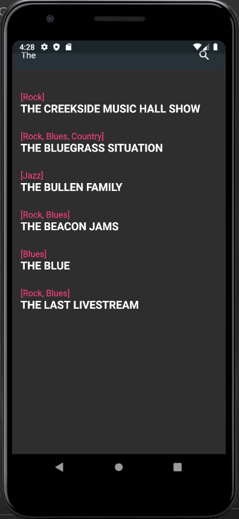
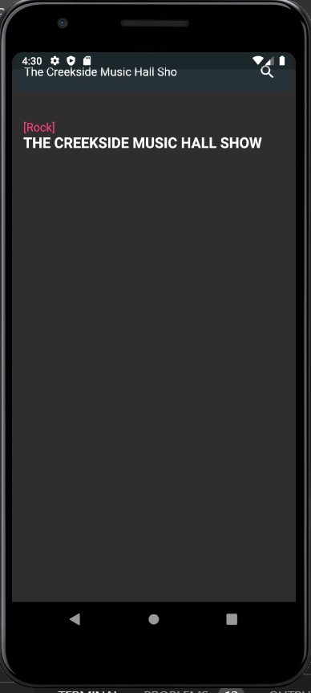

# SearchImplement

A new Flutter project for searching the queries stored in the Firestore Database.

## Getting Started

This project is a starting point for a Flutter application.

A few resources to get you started if this is your first Flutter project:

- [Lab: Write your first Flutter app](https://flutter.dev/docs/get-started/codelab)
- [Cookbook: Useful Flutter samples](https://flutter.dev/docs/cookbook)

For help getting started with Flutter, view our
[online documentation](https://flutter.dev/docs), which offers tutorials,
samples, guidance on mobile development, and a full API reference.

## How to setup?
#### Prerequisites
1. Installed flutter sdk
2. Path variables correctly setup

```
1. Clone repository
2. Run get dependencies (Android studios)
3. Run on your device/emulator
```
#### The Project Structure

This project contains 2 pages
1. To add the concert details automatically
2. To display the search results based on the data stored in the firestore database


## The screenshots:



## The video implementation

https://drive.google.com/file/d/1cH3ga2XXvESzhOU-djGO1Bt9Giw87JzZ/view?usp=sharing

## The apk of the app is stored in the folder

https://drive.google.com/file/d/1q1fL7nlspFrs8bqX-JenEBABdqwKE8H0/view?usp=sharing


## Technologies Used:

 
